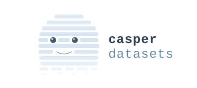

# CasperDatasets

<p align="center">
  
</p>

[](https://github.com/liangjh/casperdatasets/actions/workflows/ci.yml)

A lightweight, zero-dependency in-memory dataset framework for Java.

CasperDatasets provides a simple, thread-safe, tabular data structure with typed columns, primary key indexing, filtering, sorting, and aggregation -- all without any external dependencies.

## Features

- **In-memory tabular data** with named, typed columns and primary key indexing
- **Thread-safe container** (`CDataCacheContainer`) for concurrent read/write access
- **Cursor-based rowset** (`CDataRowSet`) with JDBC ResultSet-style navigation
- **Type-safe accessors** for String, Integer, Double, Boolean, Date, Timestamp, and more
- **Filtering** with equals, range, regex, greater-than/less-than, and date range filters
- **Sorting** on single or multiple columns with type-aware comparisons
- **Aggregation** -- sum, average, min, max, weighted sum, weighted average
- **JDBC integration** -- load directly from a `ResultSet`, or wrap a dataset as a `ResultSet`
- **Builder/Exporter pattern** for pluggable data sources and destinations
- **Zero external dependencies** -- pure Java, works with Java 11+

## Installation

### Gradle

```groovy
implementation 'net.casper:casperdatasets:3.0.0'
```

### Maven

```xml
<dependency>
    <groupId>net.casper</groupId>
    <artifactId>casperdatasets</artifactId>
    <version>3.0.0</version>
</dependency>
```

### Manual

Download the JAR from [GitHub Releases](https://github.com/liangjh/casperdatasets/releases) and add it to your classpath.

## Quick Start

### Create a dataset

```java
import net.casper.data.model.*;

// Define columns and types
String[] columns = {"id", "name", "age", "score"};
Class[] types = {Integer.class, String.class, Integer.class, Double.class};
String[] primaryKey = {"id"};

// Create the container
CRowMetaData meta = new CRowMetaData(columns, types, primaryKey);
CDataCacheContainer container = new CDataCacheContainer("students", meta);

// Add rows
container.addSingleRow(new Object[]{1, "Alice", 25, 92.5});
container.addSingleRow(new Object[]{2, "Bob", 30, 87.3});
container.addSingleRow(new Object[]{3, "Charlie", 22, 95.1});
```

### Query and iterate

```java
// Get all rows sorted by primary key
CDataRowSet rowset = container.getAll();

while (rowset.next()) {
    String name = rowset.getString("name");
    int age = rowset.getInt("age");
    double score = rowset.getDouble("score");
    System.out.println(name + " (age " + age + "): " + score);
}
```

### Filter data

```java
import net.casper.data.model.filters.*;

// Equality filter -- find specific values
EqualsFilter filter = new EqualsFilter("name", new Object[]{"Alice", "Charlie"});
CDataFilterClause clause = new CDataFilterClause();
clause.addFilter(filter);

CDataRowSet results = container.get(clause);
// results contains only Alice and Charlie

// Range filter -- find values in a range
RangeFilter ageRange = new RangeFilter("age", 20, 28);
CDataFilterClause ageClause = new CDataFilterClause();
ageClause.addFilter(ageRange);

CDataRowSet youngStudents = container.get(ageClause);

// Regex filter
RegexFilter nameFilter = new RegexFilter("name", "^[A-B].*");
CDataFilterClause nameClause = new CDataFilterClause();
nameClause.addFilter(nameFilter);

CDataRowSet abStudents = container.get(nameClause);
```

### Sort data

```java
// Sort by score descending
CDataRowSet sorted = container.getAll(new String[]{"score"}, false);

sorted.reset();
while (sorted.next()) {
    System.out.println(sorted.getString("name") + ": " + sorted.getDouble("score"));
}
// Output: Charlie: 95.1, Alice: 92.5, Bob: 87.3
```

### Aggregate data

```java
CDataRowSet all = container.getAll();

Double total = CDataRowSetAggregator.sum(all, "score");
Double avg = CDataRowSetAggregator.average(all, "score");
Double max = CDataRowSetAggregator.max(all, "score");
Double min = CDataRowSetAggregator.min(all, "score");
```

### Composite primary keys

```java
String[] columns = {"firstName", "lastName", "department"};
Class[] types = {String.class, String.class, String.class};
String[] compositeKey = {"firstName", "lastName"};

CRowMetaData meta = new CRowMetaData(columns, types, compositeKey);
CDataCacheContainer container = new CDataCacheContainer("employees", meta);
```

### No primary key (identity-based)

```java
// When no primary key is specified, an auto-incrementing identity key is used
CDataCacheContainer container = CDataCacheContainer.newInsertionOrdered(
    "log", "timestamp,message,level",
    new Class[]{String.class, String.class, String.class}
);
```

### Load from JDBC ResultSet

```java
import net.casper.data.model.CDataCacheDBAdapter;

ResultSet rs = statement.executeQuery("SELECT id, name, age FROM students");
CDataCacheContainer container = CDataCacheDBAdapter.loadData(
    rs, "students", new String[]{"id"}, new HashMap()
);
```

### Build from custom source (CBuilder)

```java
CBuilder builder = new CBuilder() {
    private int index = 0;
    private Object[][] data = {
        {1, "Alice"}, {2, "Bob"}, {3, "Charlie"}
    };

    public String getName() { return "custom"; }
    public String[] getColumnNames() { return new String[]{"id", "name"}; }
    public Class[] getColumnTypes() { return new Class[]{Integer.class, String.class}; }
    public String[] getPrimaryKeyColumns() { return new String[]{"id"}; }
    public Map getConcreteMap() { return new HashMap(); }
    public void open() {}
    public void close() {}

    public Object[] readRow() {
        if (index >= data.length) return null;
        return data[index++];
    }
};

CDataCacheContainer container = new CDataCacheContainer(builder);
```

### Merge containers

```java
// Merge data from one container into another on join columns
int rowsUpdated = targetContainer.merge(sourceContainer, new String[]{"id"});
```

### Non-unique index for faster lookups

```java
container.addNonUniqueIndex("department");
// Subsequent equality filters on "department" will use the index
```

## Architecture

| Class | Description |
|-------|-------------|
| `CDataCacheContainer` | Thread-safe container. Stores rows keyed by primary key. Supports add, remove, filter, merge, and export. |
| `CDataRowSet` | Cursor-based rowset for iterating over query results. Not thread-safe. |
| `CDataRow` | A single row of data (wrapper around `Object[]`). |
| `CRowMetaData` | Column names, types, and primary key configuration. Implements `ResultSetMetaData`. |
| `CBuilder` | Interface for building a container from any data source. |
| `CExporter` | Interface for exporting a container to any destination. |
| `CDataCacheDBAdapter` | Loads a container directly from a JDBC `ResultSet`. |
| `CDataResultSet` | Wraps a `CDataRowSet` as a JDBC `ResultSet`. |
| `CDataRowSetAggregator` | Static aggregation methods: sum, average, min, max, weighted sum/average. |
| `CDataConverter` | Type conversion between supported data types. |
| `CDataComparator` | Multi-column, type-aware comparator for sorting. |

### Filters

| Filter | Description |
|--------|-------------|
| `EqualsFilter` | Match rows where column equals any of the given values. Supports negation. |
| `RangeFilter` | Match rows where column value falls within a numeric range. |
| `GEFilter` | Match rows where column value is greater than or equal to a threshold. |
| `LEFilter` | Match rows where column value is less than or equal to a threshold. |
| `RegexFilter` | Match rows where column value matches a regular expression. |
| `DateRangeFilter` | Match rows where a date column falls within a date range. |
| `CDataFilterClause` | Combines multiple filters with AND logic. |

## Building from Source

```bash
./gradlew build
```

This compiles the source, runs tests, and produces the JAR at `build/libs/casperdatasets-<version>.jar`.

## Releasing

Push a version tag to create a GitHub Release with downloadable JARs:

```bash
git tag v3.0.0
git push origin v3.0.0
```

## License

Apache License 2.0
